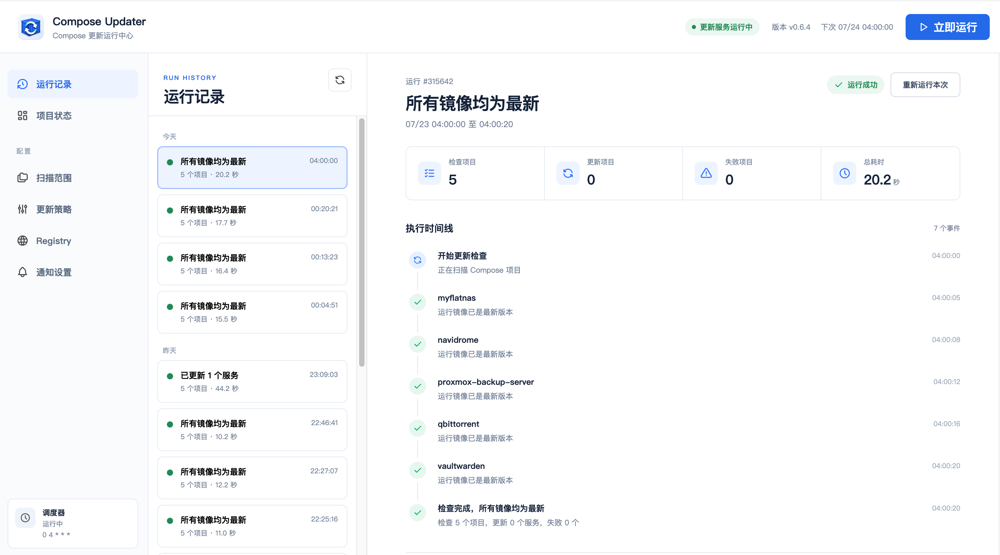

# compose-updater

[](https://github.com/guchengod/compose-updater/actions/workflows/ci.yml)
[](https://github.com/guchengod/compose-updater/actions/workflows/container.yml)
[](https://github.com/guchengod/compose-updater/releases/latest)
[](LICENSE)

一个面向自托管环境的 Docker Compose 自动更新器。它发现正在运行的 Compose 项目，查询镜像仓库中的目标版本，只更新真正发生变化的服务，并在失败时恢复 Compose 文件和旧服务。



## 特性

- 自动扫描多个目录及其子目录中的 Compose 文件。
- 支持 Docker Hub、GHCR、Harbor、云厂商 Registry 和私有 Registry。
- 默认更新到最高稳定版本，也可跟随最新发布标签，包括预发布版和 SHA 构建。
- 固定版本和 `sha-*` 标签可以自动回写为目标标签。
- `latest` 标签不修改 Compose，只在远端镜像摘要变化时重建服务。
- 仅处理当前正在运行且声明了 `image:` 的服务，不自动启动已停止项目。
- 原子修改 Compose、自动备份、配置校验、失败恢复和健康稳定性检查。
- Bark 成功、可用更新和失败通知。
- Registry Bearer/Basic 鉴权、Docker 凭据和 HTTP/SOCKS5 查询代理。
- 飞牛 fnOS 原生 FPK、桌面入口和管理员配置页面。
- Linux、macOS、Windows 原生二进制，以及 `linux/amd64`、`linux/arm64` GHCR 镜像。

> [!WARNING]
> `stable_only: true` 仍允许跨大版本升级，例如 `postgres:16` 可能升级到 `postgres:18`。数据库、同步协议敏感应用和其他存在破坏性升级风险的服务，必须先确认升级路径并做好数据备份。

## 工作方式

一次更新周期会执行以下闭环：

1. 扫描配置目录中的 Compose 文件。
2. 使用 `docker compose config --format json` 读取真实生效配置。
3. 只选择当前有运行容器、声明了 `image:` 且不含 `build:` 的服务。
4. 根据 Compose 镜像引用查询对应 Registry，而不是统一查询 Docker Hub。
5. 按 `stable_only` 选择目标标签；`latest` 保持标签不变。
6. 记录运行容器的 Image ID，并拉取目标镜像。
7. Image ID 不同才执行 `docker compose up -d --no-deps --no-build --wait`。
8. 验证容器持续处于 running/healthy 状态。
9. 发送成功、可用更新或失败通知。

固定标签发生变化时，程序会先原子回写 Compose 并创建 `<compose-file>.compose-updater.bak`。后续拉取、重建或健康检查失败时，会恢复原文件并尝试恢复旧服务。

## 快速开始：使用 GHCR 镜像

### 1. 准备目录

```bash
mkdir -p /opt/compose-updater/data
cd /opt/compose-updater

curl -fsSLo compose.yaml https://raw.githubusercontent.com/guchengod/compose-updater/main/compose.example.yaml
curl -fsSLo config.json https://raw.githubusercontent.com/guchengod/compose-updater/main/config.example.json
curl -fsSLo .env https://raw.githubusercontent.com/guchengod/compose-updater/main/.env.example
```

### 2. 配置扫描路径

假设宿主机的 Compose 项目集中在 `/srv/compose`，修改 `config.json`：

```json
{
  "version": 1,
  "paths": [
    "/srv/compose"
  ],
  "skip_dirs": [
    "/srv/compose/compose-updater"
  ],
  "depth": 2,
  "schedule": "0 4 * * *",
  "timezone": "Asia/Shanghai",
  "run_on_start": true,
  "stable_only": true,
  "registry_proxy": "",
  "bark": {
    "enabled": false,
    "endpoint": "https://api.day.app/push",
    "device_key": "",
    "device_key_env": "BARK_DEVICE_KEY",
    "group": "Docker更新"
  }
}
```

同时修改 `compose.yaml` 的扫描目录挂载，容器内外路径必须一致：

```yaml
services:
  compose-updater:
    image: ghcr.io/guchengod/compose-updater:latest
    restart: unless-stopped
    environment:
      COMPOSE_UPDATER_WEB_PASSWORD: ${COMPOSE_UPDATER_WEB_PASSWORD:?请先设置运行中心密码}
    ports:
      - "8080:8080"
    volumes:
      - /var/run/docker.sock:/var/run/docker.sock
      - ./config.json:/config/config.json:rw
      - ./data:/data
      - /srv/compose:/srv/compose:rw
    command: ["web", "-config", "/config/config.json", "-listen", "0.0.0.0:8080"]
```

必须使用可写挂载，因为目标标签变化时程序需要修改 Compose 文件。`config.json` 也需要可写，运行中心才能保存配置；只使用 `serve` 命令时可以改回只读。

### 3. 校验并启动

```bash
docker compose run --rm compose-updater validate -config /config/config.json
docker compose run --rm compose-updater scan -config /config/config.json
docker compose run --rm compose-updater check -config /config/config.json
docker compose up -d
```

查看日志：

```bash
docker compose logs -f compose-updater
```

浏览器访问 `http://服务器地址:8080/`，使用 `.env` 中的 `COMPOSE_UPDATER_WEB_USERNAME`（默认 `admin`）和 `COMPOSE_UPDATER_WEB_PASSWORD` 登录。页面与飞牛 FPK 共用同一套运行记录、项目状态、目录选择和配置前端。

立即执行一次真实更新：

```bash
docker compose run --rm compose-updater run -config /config/config.json
```

`check` 会拉取镜像用于比较，但不会修改 Compose 或重建容器。`run` 会应用更新。

## 快速开始：飞牛 fnOS FPK

从 [GitHub Releases](https://github.com/guchengod/compose-updater/releases/latest) 按 NAS 架构下载 FPK：

- `x86_64` / `amd64`：`ComposeUpdater-vX.Y.Z-x86.fpk`
- `aarch64` / `arm64`：`ComposeUpdater-vX.Y.Z-arm.fpk`

在飞牛应用中心手动安装后，从桌面打开 **Compose Updater**。首页会展示最近运行、项目结果、执行时间线和技术详情，并支持立即运行；管理员可以通过飞牛风格的 NAS 目录选择器配置扫描/跳过目录，也可以配置 Cron、稳定版策略、Registry 代理和 Bark。保存成功会原子写入配置并重启更新服务。FPK 使用飞牛统一网关和 Unix Socket，不开放额外端口。

代理测试访问 Docker Registry `/v2/` 时，Docker Hub 通常返回 `401 Unauthorized` 并提供认证挑战。这表示代理和 Registry 均已连通，飞牛页面会明确显示为预期响应，而不是连接错误。

FPK 需要访问 Docker Socket 和改写 Compose，因此以 `root` 身份运行。安装步骤、权限说明、页面字段、升级和排障见 [飞牛 fnOS 完整教程](docs/FNOS.md)。同一套运行中心也可由 Docker 镜像和原生二进制的 `web` 命令启动；飞牛仍使用统一网关，不额外开放端口。

## 镜像标签选择策略

### `stable_only: true`（默认）

选择仓库中最高的稳定数字版本，忽略 `alpha`、`beta`、`rc`、`dev`、`nightly`、`canary` 等预发布标签：

```text
example/app:1.2.3 → example/app:2.0.0
example/app:sha-a1b2c3d → example/app:v2.0.0
```

已有数字标签会保持 `v` 前缀和变体后缀：

```text
v1.2.3       只与其他 v* 稳定版本比较
1.2.3-alpine 只与其他 *-alpine 稳定版本比较
```

支持 `1`、`1.2`、`1.2.3`、`v1.2.3`、`2026.07.1`、`1.2.3-alpine` 等形式。

### `stable_only: false`

- Docker Hub：按标签最后更新时间选择最新发布标签，因此可以从旧 SHA 前进到新 SHA、`main` 或预发布构建。
- 其他 Registry：OCI Registry V2 没有标准标签发布时间字段，因此优先使用 `latest`，没有 `latest` 时回退到最高版本标签。

### `latest`

Compose 中已经使用 `latest` 时不回写文件。程序每次执行 `docker compose pull`，再比较运行容器和拉取后镜像的 Image ID；不同才重建服务。

## 配置参考

完整配置：

```json
{
  "version": 1,
  "paths": ["/srv/compose"],
  "skip_dirs": ["/srv/compose/compose-updater"],
  "depth": 2,
  "schedule": "0 4 * * *",
  "timezone": "Asia/Shanghai",
  "run_on_start": true,
  "stable_only": true,
  "registry_proxy": "",
  "bark": {
    "enabled": true,
    "endpoint": "https://api.day.app/push",
    "device_key": "",
    "device_key_env": "BARK_DEVICE_KEY",
    "group": "Docker更新"
  }
}
```

| 字段 | 默认值 | 说明 |
|---|---:|---|
| `version` | `1` | 配置格式版本，目前只支持 `1` |
| `paths` | 无 | 必填，扫描根目录的绝对路径列表 |
| `skip_dirs` | `[]` | 跳过的绝对目录列表；命中后整个子树都不再扫描 |
| `depth` | `1` | 递归扫描深度，范围 `0-5` |
| `schedule` | `0 4 * * *` | 标准五段 Cron |
| `timezone` | `Asia/Shanghai` | IANA 时区 |
| `run_on_start` | `true` | `serve` 启动后立即运行一次 |
| `stable_only` | `true` | 只选择稳定版本；`false` 跟随最新发布标签 |
| `registry_proxy` | 空 | 程序查询 Registry 使用的 HTTP/HTTPS/SOCKS5/SOCKS5H 代理 |
| `bark.enabled` | `false` | 启用 Bark 通知 |
| `bark.endpoint` | `https://api.day.app/push` | Bark Server，程序会自动补 `/push` |
| `bark.device_key` | 空 | Bark Device Key；建议使用环境变量代替 |
| `bark.device_key_env` | `BARK_DEVICE_KEY` | 读取 Device Key 的环境变量名 |
| `bark.group` | `Docker更新` | Bark 通知分组 |

配置使用严格 JSON 解析，未知字段、多个 JSON 值或非法类型都会报错。

### 扫描深度

```text
depth=0：只扫描根目录本身
depth=1：包含直接子目录
depth=2：再向下扫描一层
...
depth=5：最大允许值
```

`skip_dirs` 优先于 `depth`。无论扫描深度配置为多少，只要当前目录等于跳过目录或位于其下方，程序都会立即剪枝。容器部署时必须填写容器内可见、并与 `paths` 对应的绝对路径。例如扫描 `/home`，但不希望扫描 updater 自身和数据库目录：

```json
"paths": ["/home"],
"skip_dirs": [
  "/home/compose-update",
  "/home/postgresql"
],
"depth": 5
```

识别以下文件名，同一目录有多个文件时按此顺序选择第一个：

```text
compose.yml
compose.yaml
docker-compose.yml
docker-compose.yaml
```

### 定时任务

`schedule` 使用标准五段 Cron：

```text
0 4 * * *     每天 04:00
0 */6 * * *   每 6 小时
30 2 * * 0    每周日 02:30
```

时间按 `timezone` 解释。

## CLI

```text
compose-updater validate -config config.json
compose-updater scan     -config config.json
compose-updater check    -config config.json
compose-updater run      -config config.json
compose-updater serve    -config config.json
compose-updater web      -config config.json [-listen 127.0.0.1:8080]
compose-updater version
```

| 命令 | 行为 |
|---|---|
| `validate` | 校验配置、扫描路径和 Compose 基础结构 |
| `scan` | 输出发现的 Compose 文件列表 |
| `check` | 查询并拉取目标镜像，只报告可用更新 |
| `run` | 立即执行一次完整更新 |
| `serve` | 常驻运行并按 Cron 调度 |
| `web` | 启动调度服务和共享运行中心；默认仅监听 `127.0.0.1:8080` |
| `version` | 输出版本、提交和构建时间 |

## Bark 通知

推荐不要把 Device Key 写入 `config.json`：

```json
"bark": {
  "enabled": true,
  "endpoint": "https://api.day.app/push",
  "device_key": "",
  "device_key_env": "BARK_DEVICE_KEY",
  "group": "Docker更新"
}
```

在 `.env` 中配置：

```env
BARK_DEVICE_KEY=your-device-key
```

以下情况会通知：

- `check` 发现可用更新。
- `run` 成功修改标签或重建服务。
- Registry 查询、Compose 校验、镜像拉取、服务重建、健康检查、Docker 前置检查或调度发生错误。

没有更新时不会发送成功通知。

## Registry、凭据与代理

### 仓库地址

程序按镜像引用中的真实主机查询：

```text
nginx:1.29                         → registry-1.docker.io/library/nginx
team/app:v1                       → registry-1.docker.io/team/app
ghcr.io/team/app:v1               → ghcr.io/team/app
registry.example.com:5000/app:v1  → registry.example.com:5000/app
```

只有没有显式 Registry 主机时才默认使用 Docker Hub。

### 私有仓库凭据

程序读取 `$DOCKER_CONFIG/config.json`；未设置时读取 `~/.docker/config.json`，支持 Registry V2 Bearer 和 Basic 鉴权。在容器中可挂载：

```yaml
- /root/.docker/config.json:/root/.docker/config.json:ro
```

私有 HTTP Registry：

```env
COMPOSE_UPDATER_INSECURE_REGISTRIES=registry.local:5000,192.168.1.10:5000
```

生产环境应优先使用 HTTPS。

### 查询代理

`registry_proxy` 用于 compose-updater 自身的标签、Docker Hub 元数据和鉴权 token 请求：

```json
"registry_proxy": "http://proxy.example.com:7890"
```

也支持 `https://`、`socks5://` 和 `socks5h://`。留空时遵循 `HTTP_PROXY`、`HTTPS_PROXY`、`NO_PROXY` 环境变量。

> [!IMPORTANT]
> `docker compose pull` 由 Docker Engine 执行。`registry_proxy` 无法改变 Docker daemon 的网络；Docker Engine 或 Docker Desktop 必须单独配置拉取代理。容器部署时，代理地址也必须能从容器内部访问。

## 高级环境变量

| 环境变量 | 默认值 |
|---|---:|
| `LOG_LEVEL` | `info` |
| `DOCKER_COMMAND` | `docker` |
| `COMPOSE_UPDATER_DATA_DIR` | 配置文件同级 `data` |
| `COMPOSE_UPDATER_SKIP_FILES` | 空 |
| `COMPOSE_UPDATER_WEB_LISTEN` | `127.0.0.1:8080` |
| `COMPOSE_UPDATER_WEB_USERNAME` | `admin` |
| `COMPOSE_UPDATER_WEB_PASSWORD` | 空；监听非本机地址时必填 |
| `COMPOSE_UPDATER_RUNTIME_STATE` | 数据目录下的 `runtime.json` |
| `COMPOSE_UPDATER_CONFIG_TIMEOUT` | `90s` |
| `COMPOSE_UPDATER_REGISTRY_TIMEOUT` | `2m` |
| `COMPOSE_UPDATER_PULL_TIMEOUT` | `15m` |
| `COMPOSE_UPDATER_UPDATE_TIMEOUT` | `10m` |
| `COMPOSE_UPDATER_HEALTH_TIMEOUT` | `3m` |
| `COMPOSE_UPDATER_HEALTH_POLL_INTERVAL` | `3s` |
| `COMPOSE_UPDATER_STABLE_DURATION` | `10s` |
| `COMPOSE_UPDATER_NOTIFY_TIMEOUT` | `15s` |

## 安装原生二进制

从 [Releases](https://github.com/guchengod/compose-updater/releases/latest) 下载对应平台。Linux amd64 示例：

```bash
VERSION=v0.6.1
curl -fLO "https://github.com/guchengod/compose-updater/releases/download/${VERSION}/compose-updater-${VERSION}-linux-amd64.tar.gz"
curl -fLO "https://github.com/guchengod/compose-updater/releases/download/${VERSION}/SHA256SUMS"
sha256sum -c --ignore-missing SHA256SUMS
tar -xzf "compose-updater-${VERSION}-linux-amd64.tar.gz"
sudo install -m 0755 "compose-updater-${VERSION}-linux-amd64/compose-updater" /usr/local/bin/compose-updater
compose-updater version
```

发布产物：

```text
linux/amd64   .tar.gz
linux/arm64   .tar.gz
darwin/amd64  .tar.gz
darwin/arm64  .tar.gz
windows/amd64 .zip
windows/arm64 .zip
```

原生运行仍要求本机已安装 Docker Engine 和 Docker Compose v2：

```bash
docker version
docker compose version
compose-updater validate -config ./config.json
compose-updater serve -config ./config.json
```

需要网页运行中心时，改用：

```bash
# 仅本机访问，无需密码
compose-updater web -config ./config.json

# 局域网访问必须设置密码
COMPOSE_UPDATER_WEB_PASSWORD='请改成强密码' \
  compose-updater web -config ./config.json -listen 0.0.0.0:8080
```

然后访问 `http://127.0.0.1:8080/` 或服务器的 `8080` 端口。`web` 会在后台托管同一程序的 `serve` 子进程，因此不要再同时启动另一个 `serve` 实例。

## 不自动处理的服务

- 含 `build:` 的本地构建服务。
- 当前没有运行容器的服务。
- `image:` 使用 `${VARIABLE}` 的动态引用时不自动回写标签。
- 使用 `@sha256:` digest 固定的镜像不自动回写标签。
- 主 Compose 文件中没有可直接修改的 `image:` 标量，例如 YAML merge、外部继承或行内对象形式。
- 多 YAML 文档或使用 Tab 的非标准缩进文件。

## 安全与恢复

- Docker Socket 等同于宿主机级 Docker 控制权限，只运行可信镜像和可信配置。
- Linux/macOS 使用 `flock`，Windows 使用 `LockFileEx`，避免多个周期并发执行。
- Compose 文件通过同目录临时文件原子替换。
- 每次标签回写都创建 `.compose-updater.bak`。
- 新配置校验或更新失败时恢复原 Compose，并尝试恢复旧容器。
- `latest` 不修改 Compose，因此无法通过旧标签回滚；应用数据必须有独立备份。
- 默认跨主版本选择策略可能带来破坏性升级，重要服务建议独立目录管理或人工审核。

## 常见问题

### 扫描不到 Compose 文件

先运行：

```bash
compose-updater scan -config config.json
```

确认 `paths` 是绝对路径、挂载路径在容器内存在、文件名受支持、`depth` 足够，并检查目标目录是否位于 `skip_dirs` 中。

### 项目被跳过

程序只更新当前正在运行、有 `image:` 且没有 `build:` 的服务。使用 `docker compose ps` 确认服务状态。

### 能查询标签但拉取失败

Registry 查询由 compose-updater 发起，镜像拉取由 Docker Engine 发起。请同时检查 `registry_proxy` 和 Docker daemon 代理、DNS及私有仓库登录状态。

### 返回 `instance_already_running`

另一个 `run`、`check` 或 `serve` 已持有锁。不要删除正在使用的锁文件，应先确认并停止已有进程。

### Compose 被修改后更新失败

程序会恢复原 Compose，并在同目录保留 `.compose-updater.bak`。检查通知和日志中的原始错误，再确认容器及数据状态。

## 本地开发

要求 Go 1.26 和 Docker Compose v2：

```bash
go test ./...
go test -race ./...
go vet ./...
make build
make build-all
make docker-build
```

## License

[MIT](LICENSE)

版本变化见 [CHANGELOG.md](CHANGELOG.md)。参与开发请阅读 [CONTRIBUTING.md](CONTRIBUTING.md)，安全问题请按照 [SECURITY.md](SECURITY.md) 私密报告。
